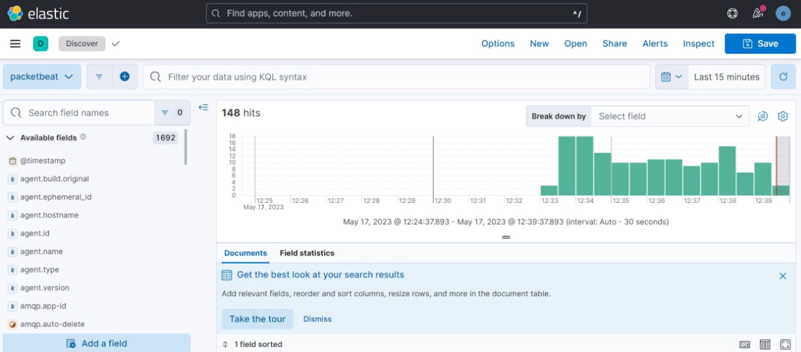

# Развертывание системы мониторинга ELK Stack (Opensearch)
Поспелова Ульяна БИСО-03-20

## Цель работы

1\. Освоить базовые подходы централизованного сбора и накопления
информации

2\. Освоить современные инструменты развертывания контейнирозованных
приложений

3\. Закрепить знания о современных сетевых протоколах прикладного уровня

## Ход выполнения практической работы

### Задание 1. Развернуть систему мониторинга на базе ElasticSearch

1\. Настройка

Для работы ElasticSearch требуется увеличить размер виртуальной памяти
системы:

    sudo sysctl -w vm.max_map_count=262144

2\. Создание docker-compose.yml

Следуем инструкции по приведённой ниже ссылке для кормирования файлов
docker-compose.yml и .env :
https://www.elastic.co/guide/en/elasticsearch/reference/current/docker.html

3\. Создание filebeat.yml и packetbeat.yml

Скачиваем и редактируем файлы

4\. Разворачиваем сервис с помощью команды:

    docker-compose up

4\. Переходим на `localhost:5061` и авторизируемся

5\. Проверям, что установленны все средства для сбора информации из
файлов журналов и сбора аналитики трафика

6\. Создаем новый data view для packetbeat

## Оценка результата

Была развёрнута система ElasticSearch и настроена система сбора трафика
и лог-файлов.

## Вывод

В результате работы была освоена система контейнеризации приложений
Docker, работа с Docker-compose и освоена система централизованного
сбора и накопления информации ElasticSearch.
