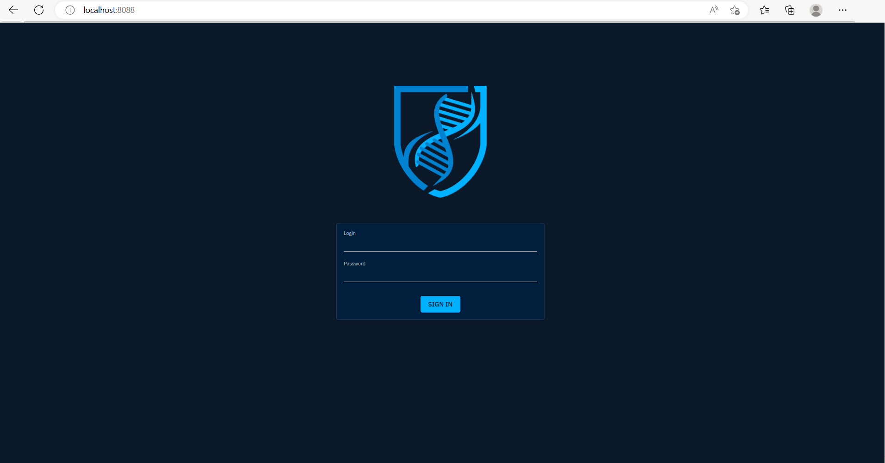
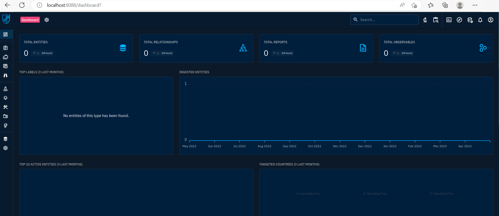

# Развертывание Threat intelligence Platform OpenCTI
Поспелова Ульяна БИСО-03-20

## Цель работы

1.  Освоить базовые подходы процессов Threat Intelligence

2.  Освоить современные инструменты развертывания контейнеризованных
    приложений

3.  Получить навыки поиска информации об угрозах ИБ

## Ход выполнения практической работы

Для разворачивания системы threat intelligence OpenCTI была использована
система контейнеризации приложений Docker.

### 1. Предварительная конфигурация

Для работы ElasticSearch требуется увеличить размер виртуальной памяти
системы:

    sudo sysctl -w vm.max_map_count=262144

### 2. Создание docker-compose.yml и file.env

Был скачан и отредактирован файл по ссылке:
https://github.com/OpenCTI-Platform/docker

### 3. Развёртывание сервиса

Разворачиваем сервис с помощью команды:

    docker-compose up 

#### 4. Использование системы Threat intelligence OpenCTI

1\. После перехода на веб-ресурс OpenCTI видим страницу авторизации.

2\. Входим по указанным в конфигурации окружения логину и паролю.

После входа появляется веб-интерфейс:

## Оценка результата

Таким образом, были изучены возможности работы с платформой Threat
intelligence OpenCTI.

## Выводы

Таким образом, были изучены возможности работы с платформой Threat
intelligence OpenCTI.
