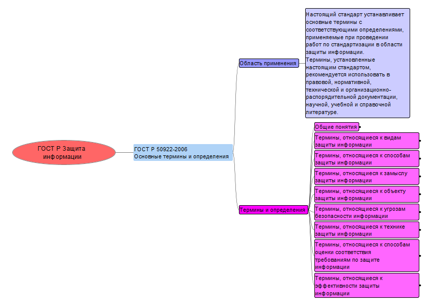
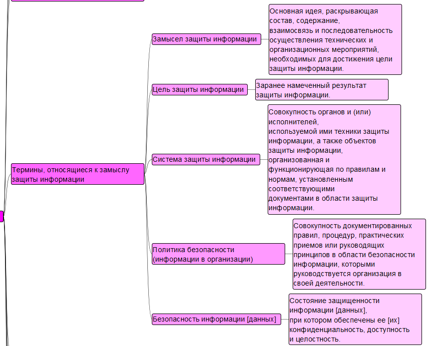

# Изучение ГОСТ
Поспелова Ульяна БИСО-03-20

## Цель работы

Изучить ГОСТ по защите информации и познакомиться с построением
mind-карты

## Ход работы

1.  Для построения mind-карты был взят ГОСТ Р 50922-2006 Защита
    информации. Основные термины и определения. Ссылка на документ -
    https://apkbg.info/wp-content/uploads/2020/12/GOST-P-50922-2006.pdf

2.  Была использована программа Freeplane

3.  Результат 
     
    
     
    
     
    
     
    
     
    

## Оценка результата

Был изучен ГОСТ Р 50922-2006 Защита информации. Основные термины и
определения и была построена mind-карта в программе Freeplane.

## Вывод

Таким образом, был изучен ГОСТ и правила построения mind-карт.
